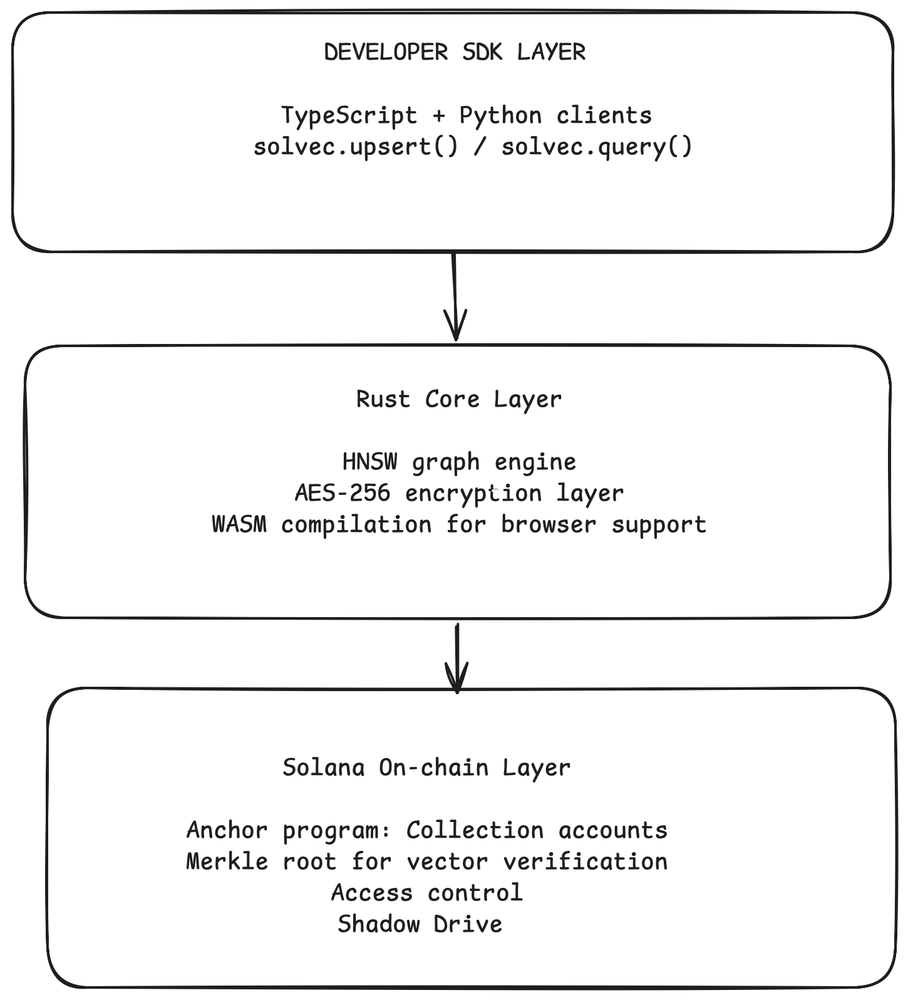

# VecChain ⚡

> Decentralized vector database for AI agents. Rust-speed HNSW + Solana provenance.

[Benchmarks] [Docs] [Discord] [npm]

## Why VecChain?

-🦀 **2.3ms p99** query latency (vs 18ms Pinecone) — Rust HNSW core
-🔐 **Cryptographic proof** of every vector — Solana on-chain Merkle roots
-💸 **10x cheaper** than Pinecone — decentralized storage, no cloud markup
-🧠 **Built for AI agents** — LangChain, AutoGen, CrewAI native integrations

## Quick Start (30 seconds)

[CODE SNIPPET GOES HERE]

## Architecture

